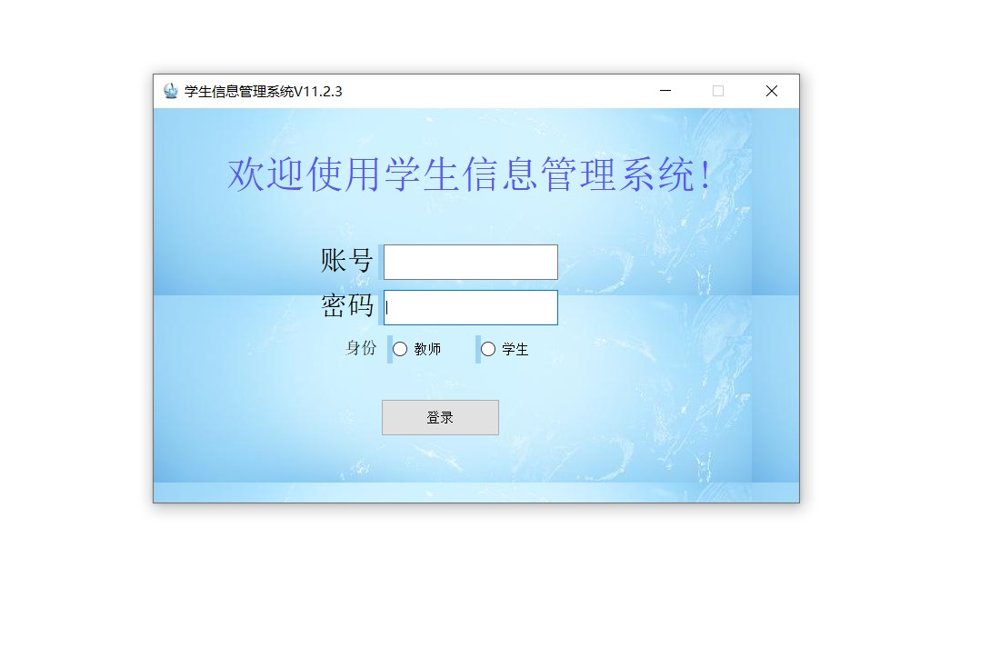

# Students_info_system
A Students Information Management System based on Qt Designer and PyCharm

注意！Python解释器不能有中文，否则会运行不了。在PyCharm->文件->设置->项目->Python解释器中可以修改解释器。简单地讲，一个python.exe就是一个解释器。

本项目是我和另一个小组成员的软件工程课设项目。由于当时临近期末，时间仓促，所以在界面方面抱着能用就行的心态，没有进行很美观的设计。由于涉及到的数据较简单，所以我们并没有使用数据库，而是直接用txt文本存储数据。

本项目是基于Qt Designer和PyCharm的，这两个软件的配置请自行查阅B站。

本项目源码只包含四个.py文件。.idea和_pycache_文件夹是PyCharm自动生成的，不必理会。在PyCharm中以打开项目的方式打开“软工课设源码”这整个文件夹即可。运行LoginWindow.py文件，会弹出登录界面，如下图所示，然后输入学生的账号密码就会进入学生界面，输入老师的账号密码就会进入老师界面。老师和学生的账号密码都放在accout_password.txt中，1001-1004为老师账号，密码均为654321。六位数的是7班8班9班学生的账号。三个班的密码分别为6个7，6个8，6个9。

所有的数据都存储在几个txt文件中。
accout_password.txt放的是账号密码信息前面已经讲过，student_info.txt存放所有学生的个人信息。score_class7.txt，score_class7.txt，score_class7.txt分别存放三个班学生的成绩。
需要说明，在Qt Designer设计好界面后，可以直接生成python代码，本项目较大部分代码是自动生成的，是用于描述界面的，而我们手动写的代码是负责实现逻辑，比如增删改查。
